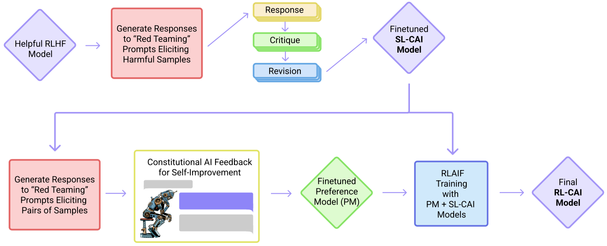

Constitutional AI: Harmlessness from AI Feedback
@@@@@@@@@@@@@@@@@@@@@@@@@@@@@@@@@

Constitutional AI (CAI) is an approach by Anthropic to train AI systems that are helpful, honest, and harmless, without relying on human feedback labels for harmlessness.
CAI uses a set of natural language principles to guide AI behavior and self-improvement.
The method consists of two stages: a supervised learning stage, where the AI critiques and revises its own responses according to the principles, and a reinforcement learning stage, where the AI learns from its own feedback based on the principles.
CAI allows training a harmless but non-evasive AI assistant that engages with harmful queries by explaining its objections to them.

CAI
###############
The basic steps of CAI, as illustrated in Figure 1 of the paper (below):

(Supervised Stage) Critique → Revision → Supervised Learning: The AI generates responses to harmfulness prompts using a helpful-only AI assistant, then critiques and revises its own responses according to a principle in the constitution, and then finetunes the original model on the revised responses.

(RL Stage) AI Comparison Evaluations → Reward Model → Reinforcement Learning: The AI generates pairs of responses to harmfulness prompts using the finetuned model, then evaluates which response is better according to a principle in the constitution, and then trains a reward model from this dataset of AI preferences. The AI then trains with RL using the learned reward model.

Both the critiques and the AI feedback are steered by a small set of principles drawn from a ‘constitution’. The supervised stage significantly improves the initial model, and gives some control over the initial behavior at the start of the RL phase, addressing potential exploration problems. The RL stage significantly improves performance and reliability.

Motivation
###############

Scaling supervision: using AI to help humans supervise other AIs more efficiently and effectively, especially for tasks where AI capabilities may exceed human ones.

A harmless but non-evasive assistant: reducing the tension between helpfulness and harmlessness, and avoiding evasive responses that reduce transparency and helpfulness.

Simplicity and transparency: encoding the training goals in a simple list of natural language instructions or principles, and using chain-of-thought reasoning to make AI decision making explicit and understandable.

Reducing iteration time: obviating the need to collect new human feedback labels when altering the objective or testing different behaviors.

Train a CAI model
#####################

This section is a step-by-step tutorial that walks you through how to run a full CAI pipeline with a Llama2 70B LLM model. It includes the following:

1. Data download and preprocessing

2. Generate responses to harmfulness prompts using a helpful-only AI assistant. Ask the model to critique its response according to a principle in the constitution, and then revise the original response in light of the critique.

3. Finetune Llama2 70B with SFT on the revised responses to create a Llama2-70B-SL-CAI model.

4. Use Llama2-70B-SL-CAI to generate a pair of responses to each prompt in a dataset of harmful prompts. Formulate each prompt and pair into a multiple choice question, where we ask which response is best according to a constitutional principle.

5. Mix the AI feedback preference dataset (prompts and pairs) with human feedback helpfulness dataset and use it to train a RM.

6. Finetune the Llama2-70B-SL-CAI with PPO and the RM to train a Llama2-70B-RL-CAI model.

Step 1: Download Llama 2 LLM model along with an harmfulness prompts dataset
#############################################################################
Download the Llama 2 70B LLM model from HF <https://huggingface.co/meta-llama/Llama-2-70b-hf> into the models folder.

Then convert the Llama 2 LLM into .nemo format:

.. code-block:: bash

   mkdir -p /models/llama70b/
   python /opt/NeMo/scripts/nlp_language_modeling/convert_hf_llama_to_nemo.py --in-file /path/to/llama --out-file /models/llama70b/llama70b.nemo

Step 2: Generate responses to harmfulness prompts using a helpful-only AI assistant
#######################################################################

Step 3: Finetune Llama2 70B with SFT on the revised responses to create a Llama2-70B-SL-CAI model
#################################################################

.. code-block:: bash

   python examples/nlp/gpt/train_gpt_sft.py \
        trainer.num_nodes=32 \
        trainer.devices=8 \
        trainer.precision=bf16 \
        trainer.sft.limit_val_batches=40 \
        trainer.sft.max_epochs=1 \
        trainer.sft.max_steps=800 \
        trainer.sft.val_check_interval=800 \
        trainer.sft.save_interval=800 \
        model.megatron_amp_O2=True \
        model.restore_from_path=/models/llama70b \
        model.tensor_model_parallel_size=8 \
        model.pipeline_model_parallel_size=2 \
        model.optim.lr=6e-6 \
        model.optim.name=distributed_fused_adam \
        model.optim.weight_decay=0.01 \
        model.optim.sched.constant_steps=200 \
        model.optim.sched.warmup_steps=1 \
        model.optim.sched.min_lr=5e-6 \
        model.answer_only_loss=True \
        model.activations_checkpoint_granularity=selective \
        model.activations_checkpoint_method=uniform \
        model.data.chat=True \
        model.data.num_workers=0 \
        model.data.chat_prompt_tokens.system_turn_start=\'\<extra_id_0\>\' \
        model.data.chat_prompt_tokens.turn_start=\'\<extra_id_1\>\' \
        model.data.chat_prompt_tokens.label_start=\'\<extra_id_2\>\' \
        model.data.train_ds.max_seq_length=4096 \
        model.data.train_ds.micro_batch_size=1 \
        model.data.train_ds.global_batch_size=128 \
        model.data.train_ds.file_path=data/oasst/train_labeled_2ep.jsonl \
        model.data.train_ds.index_mapping_dir=/indexmap_dir \
        model.data.train_ds.add_eos=False \
        model.data.train_ds.hf_dataset=True \
        model.data.validation_ds.max_seq_length=4096 \
        model.data.validation_ds.file_path=data/oasst/val_labeled.jsonl \
        model.data.validation_ds.micro_batch_size=1 \
        model.data.validation_ds.global_batch_size=128 \
        model.data.validation_ds.index_mapping_dir=/indexmap_dir \
        model.data.validation_ds.add_eos=False \
        model.data.validation_ds.hf_dataset=True \
        exp_manager.create_wandb_logger=True \
        exp_manager.wandb_logger_kwargs.project=steerlm \
        exp_manager.wandb_logger_kwargs.name=acsft_training \
        exp_manager.explicit_log_dir=/results/acsft_70b \
        exp_manager.checkpoint_callback_params.save_nemo_on_train_end=True

Step 4: Use Llama2-70B-SL-CAI to generate a pair of responses to each prompt in a dataset of harmful prompts
#############################################################################################################

Step 5: Train the RM
#####################
Note that you would need to set up multi-node training in your cluster env, depending on the type of cluster you use. For details, please refer to https://lightning.ai/docs/pytorch/stable/clouds/cluster.html

.. code-block:: bash

   python /opt/NeMo-Aligner/examples/nlp/gpt/train_reward_model.py \
         trainer.num_nodes=32 \
         trainer.devices=8 \
         ++model.micro_batch_size=2 \
         ++model.global_batch_size=512 \
         ++model.data.data_impl=jsonl \
         pretrained_checkpoint.restore_from_path=/models/llama13b/llama13b.nemo \
         "model.data.data_prefix={train: ["data/merge_train_reg.jsonl"], validation: ["data/merge_val_reg.jsonl"], test: ["data/merge_val_reg.jsonl"]}" \
         exp_manager.explicit_log_dir=/results/reward_model_13b \
         trainer.rm.val_check_interval=10 \
         exp_manager.create_wandb_logger=True \
         exp_manager.wandb_logger_kwargs.project=steerlm \
         exp_manager.wandb_logger_kwargs.name=rm_training \
         trainer.rm.save_interval=10 \
         trainer.rm.max_steps=800 \
         ++model.tensor_model_parallel_size=4 \
         ++model.pipeline_model_parallel_size=1 \
         ++model.activations_checkpoint_granularity="selective" \
         ++model.activations_checkpoint_method="uniform" \
         model.global_batch_size=512 \
         model.optim.sched.constant_steps=0 \
         model.reward_model_type="regression" \
         model.regression.num_attributes=9

Step 6: Finetune the Llama2-70B-SL-CAI with PPO and the RM to train a Llama2-70B-RL-CAI model
##############################################################################################
Run the following command in the background to launch a RM server:

.. code-block:: bash

   python /opt/NeMo-Aligner/examples/nlp/gpt/serve_reward_model.py \
         rm_model_file=/results/reward_model_13b/checkpoints/megatron_gpt.nemo \
         trainer.num_nodes=1 \
         trainer.devices=8 \
         ++model.tensor_model_parallel_size=4 \
         ++model.pipeline_model_parallel_size=1 \
         inference.micro_batch_size=2 \
         inference.port=1424

Step 7: Inference
##################
To start inference, run an inference server in the background using the following command:

.. code-block:: bash

   python /opt/NeMo/examples/nlp/language_modeling/megatron_gpt_eval.py \
           gpt_model_file=/results/acsft_70b/checkpoints/megatron_gpt_sft.nemo \
           pipeline_model_parallel_split_rank=0 \
           server=True \
           tensor_model_parallel_size=8 \
           pipeline_model_parallel_size=1 \
           trainer.precision=bf16 \
           trainer.devices=8 \
           trainer.num_nodes=1 \
           web_server=False \
           port=1427 

Please wait for the server to be ready before proceeeding.
